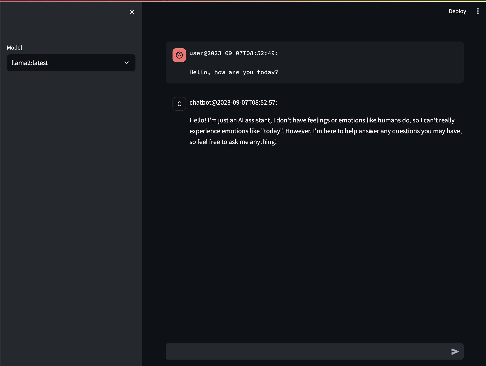

# Ollama Streamlit Chat



This is very simple chat app built using [streamlit](https://streamlit.io/), and [Ollama](https://ollama.ai/).


## Install

First you must install and run [Ollama](https://ollama.ai/) on your supported device. At the time of writing this only MacOS is supported with Linux and Windows on the roadmap.

### Clone repo
```
$ git clone https://github.com/dustyfresh/ollama-streamlit-chat.git
$ cd ollama-streamlit-chat/
```

### Install python dependencies and models

```
$ virtualenv -p python3 venv && source venv/bin/activate
$ pip install -r requirements.txt
$ for model in $(cat models.txt); do ollama pull $model; done
```

Pulling the models may take time.

You can add more models supported by Ollama [here](https://ollama.ai/library).


### Run with Streamlit

```
$ streamlit run --server.address 127.0.0.1 chat.py 
```

You should now be able to access the chat at [http://127.0.0.1:8501](http://127.0.0.1:8501)

## Further Reading

- [https://docs.streamlit.io/knowledge-base/tutorials/build-conversational-apps](https://docs.streamlit.io/knowledge-base/tutorials/build-conversational-apps)
- [https://github.com/jmorganca/ollama/blob/main/docs/api.md](https://github.com/jmorganca/ollama/blob/main/docs/api.md)